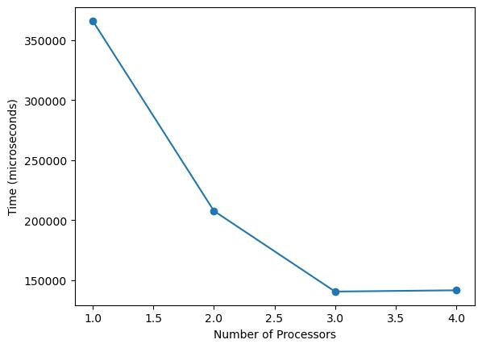
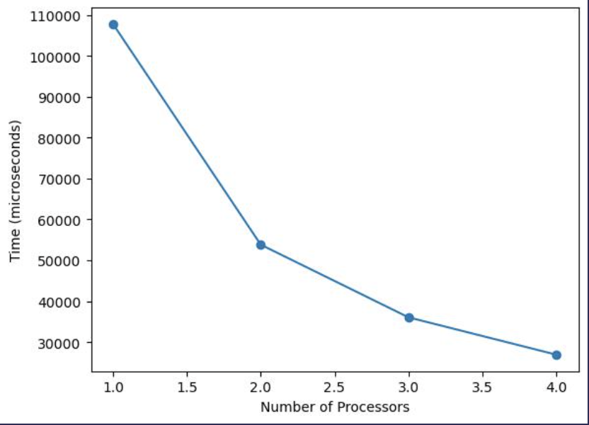
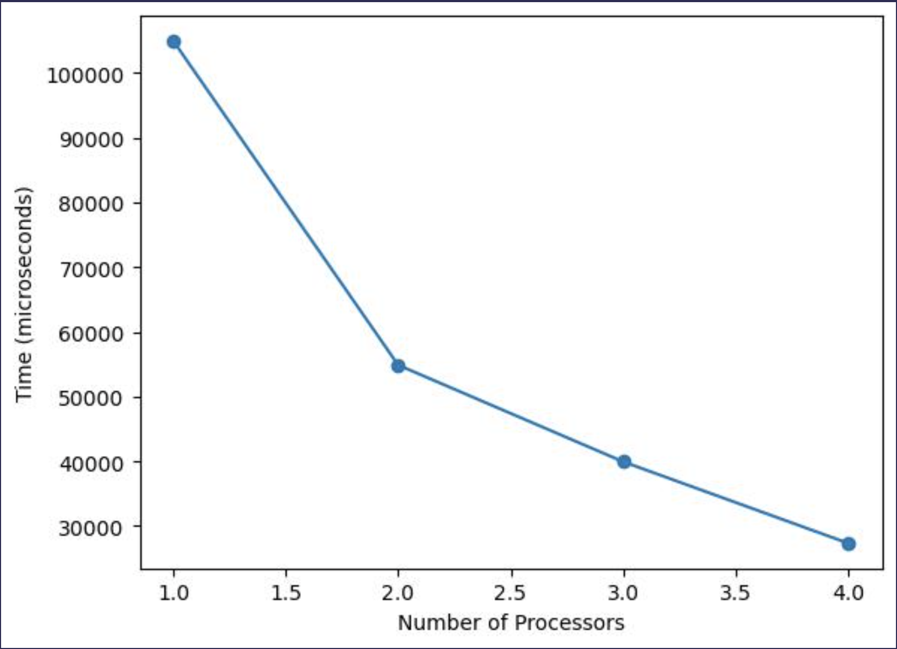
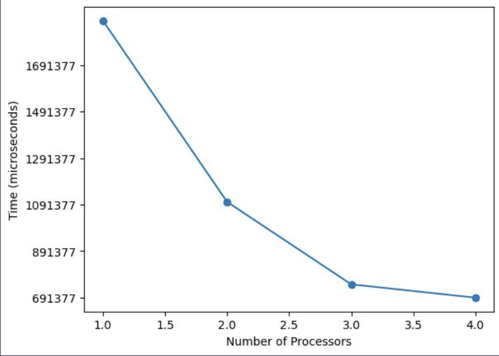

When I first learned about parallel computing I I assumed it was a one-size-fits-all solution for boosting speed whenever it could be applied. But the more I dive in, the clearer it becomes that it's not that straightforward. The real gains hinge on two key factors: you gotta know your machine, and your workload.

## What is Parallel Computing?

Parallel computing speeds up problem-solving by dividing a large task into smaller sub-tasks and executing them concurrently across multiple processors. To illustrate its benefits and limitations, let's do a little case study on a problem some people have definetly encountered on their Leetcode grind: the maximum subarray sum problem.

## What is the maximum subarray sum problem?

We can define the maximum subarray sum problem (`mss`) as follows: Given a sequence of integers, the maximum subarray sum problem requires finding the contiguous subsequence of the sequence with the maximum total sum, i.e.

$$
mss(a) = max(0, max(\sum_{k=i}^{j}a[k] : 0 \leq i, j \lt |a|))
$$

### What is the seqeuential approach?

We can solve this problem with an iterative solution using the popular Kadane's algorithm:

```cpp
int seq_mss(const std::vector<int>& arr) {
    if (arr.empty()) return 0;
    int max_sum = arr[0];
    int current_sum = arr[0];
    
    for (int i = 1; i < arr.size(); ++i) {
        current_sum = std::max(arr[i], current_sum + arr[i]);
        max_sum = std::max(max_sum, current_sum);
    }

    return max_sum;
}
```

By the end of the loop, `max_sum` will hold the maximum sum over all possible contiguous subarrays in the entire array. This is a one-pass algorithim with each step being done in constant work, thus our solution has a work of `O(n)`.


You'll often hear me use the terms "work" and "span." Work refers to the total number of steps needed for sequential execution. Span, on the other hand, is the longest chain of dependent steps when executed in parallel, assuming infinite processors. Both can be upper-bounded with asymptotic analysis.



### What is the Divide And Conquer Approach?

We can also have a different approach, using the divide and conquer method. The main idea to take note of is that given an array, we know that the maximum subarray must lie in one of these three regions:

1. Maximum subarray sum is entirely in the left half: In this case, you don't need to consider the right half at all.
2. Maximum subarray sum is entirely in the right half: Similarly, you don't need to consider the left half.
3. Maximum subarray sum crosses the midpoint: This is the trickiest case. Here, the maximum subarray starts in the left half and ends in the right half, crossing the midpoint.

To tackle this, we use a technique called *"strengthening"*, where we solve a more general problem than initially intended. Instead of just finding the `mss`, we compute a 4-tuple for each subarray that contains:

* Maximum Subarray Sum (`mss`): The largest sum of any contiguous subarray.
* Maximum Prefix Sum: The largest sum starting from the first element.
* Maximum Suffix Sum: The largest sum ending at the last element.
* Total Sum: The sum of all elements in the subarray.

These 4-tuples handle all three cases:

1. If the Maximum Subarray Sum is entirely in the left subarray, it's captured by the `mss` value of the left 4-tuple.
2. If the Maximum Subarray Sum is entirely in the right subarray, it's captured by the `mss` value of the right 4-tuple.
3. If the Maximum Subarray Sum spans both subarrays, you can find it by adding the maximum suffix sum of the left subarray to the maximum prefix sum of the right subarray.

In this algorithm, we recursively divide the array into smaller subarrays, halving the search space at each step. For each subarray, we compute a 4-tuple containing the Maximum Subarray Sum (`mss`), the maximum prefix sum, the maximum suffix sum, and the total sum—all of which is done in constant time. These 4-tuples are then combined to solve for larger subarrays.

Thus we calculate the work of our function, `par_mss` on an input of size `n` (assuming no parallelism) as follows:


$$
\begin{align*}
W_{\mathrm{par\\\_mss}}(0) &= c_1, \\\
W_{\mathrm{par\\\_mss}}(n) &= 2 * W_{\mathrm{par\\\_mss}}(n / 2) + c_k,\\\
W_{\mathrm{par\\\_mss}}(n) &= \sum_{i=0}^{logn}(2^i * (n / 2^{i} + c_k)),\\\
W_{\mathrm{par\\\_mss}}(n) &\\approx \sum_{i=0}^{logn}(n),\\\
W_{\mathrm{par\\\_mss}}(n) &\\approx O(nlogn).\\\
\end{align*}
$$

Writing and solving the recurrence of `par_mss` we see that it has a work of `O(nlogn)`. This aligns well with the algorithm's divide-and-conquer nature, where each step halves the search space, resulting in `log(n)` levels of recursion. At any given level `i`, we have `2^i` nodes each with a workload of `n/2^i`. While this may seem less efficient than our `O(n)` sequential approach, the parallel version can, under ideal (but also very theoretical) conditions, achieve a time complexity of `O(logn)`. *That's a big deal*.

#### How can parallelism *theoretically* give us better performance?

If you remember the definition from earlier, parallelism excels whenever we break a larger computational task into smaller sub-tasks. This allows us to execute these tasks concurrently across multiple processors or cores. Divide-and-conquer algorithms naturally lend themselves to parallelization because of this. Take a look at how I implemented `par_mcss`:

```cpp
std::tuple<int, int, int, int> par_mss_helper(const std::vector<int>& arr, int l, int h) {
    // Base case: single-element array
    if (l == h) return std::make_tuple(std::max(0, arr[l]), std::max(0, arr[l]), std::max(0, arr[l]), arr[l]);

    int m = (l + h) / 2;
    std::tuple<int, int, int, int> lt, rt;
    #pragma omp parallel sections
    {
        #pragma omp section
        {
            lt = par_mss_helper(arr, l, m);
        }
        #pragma omp section
        {
            rt = par_mss_helper(arr, m + 1, h);
        }
    }
    // Unpack the 4-tuples from left and right subarrays
    int lm, lp, ls, ltot, rm, rp, rs, rtot;
    std::tie(lm, lp, ls, ltot) = lt;
    std::tie(rm, rp, rs, rtot) = rt;
    // Calculate the maximum values for mss, prefix sum, suffix sum, and total sum
    int mss = std::max({lm, rm, ls + rp});
    int ps = std::max(lp, ltot + rp);
    int ss = std::max(rs, rtot + ls);
    int ts = ltot + rtot;
    // Return the 4-tuple containing the calculated maximum values
    return std::make_tuple(mss, ps, ss, ts);
}

int par_mss(const std::vector<int>& arr) {
    if (arr.empty()) return 0;
    // Call the helper function and extract the mss value from the returned 4-tuple
    auto result_tuple = par_mss_helper(arr, 0, arr.size() - 1);
    return std::get<0>(result_tuple);
}
```

In this code snippet, we use OpenMP's [#pragma omp parallel sections](https://www.openmp.org/spec-html/5.0/openmpsu65.html#x92-3140002.13.3) to parallelize the two recursive parts of the algorithm, solving the left and right half concurrently.

Now assuming we have an infinite number of processors that allow us to run tasks in parallel, the number of steps a computation takes to run can be dennoted as the *span*. Span is the worst-case parallel evaluation time, and like work, can be upper bounded with asymptotic analysis. Calculating the span of `par_mss` on an input of size `n` we get:

$$
\begin{align*}
S_{\mathrm{par\\\_mss}}(0) &= c_1, \\\
S_{\mathrm{par\\\_mss}}(n) &= max(S_{\mathrm{par\\\_mss}}(n / 2), S_{\mathrm{par\\\_mss}}(n / 2)) + c_k,\\\
S_{\mathrm{par\\\_mss}}(n) &= \sum_{i=0}^{logn}(c_k),\\\
S_{\mathrm{par\\\_mss}}(n) &= O(c_klogn) \approx O(logn).\\\
\end{align*}
$$

In simple terms, each recursive call splits the array into two halves. With parallel processing, we only need to consider the time taken by the longest of the two halves. Since we're assuming an infinite number of processors, each level of recursion takes constant time. Therefore, the span is `O(logn)`.

### What is granularity and how can it imapct the benefits we have of parallelism?

Now an improvement from `O(n)` to `O(logn)` sounds incredible. But of course, we are only talking about a theorical scenario. In practice, we have to consider 'granularity,' which refers to the size of the smallest tasks executed in parallel.

* Small tasks can be dynamically assigned to processors for better workload balance, but they also increase the overhead of task management.
* Large tasks reduce this overhead but may lead to imbalanced workloads.

Striking the right balance is crucial because, in a system with many cores, tasks can compete for resources, causing bottlenecks and diminishing the benefits of parallelism.

### A hybrid approach? Creating a parallel and sequential algorithm

Defining an optimal granularity threshold allows for a balanced interplay between parallel and sequential processing. For larger problem sizes that can benefit from parallelism, the algorithm employs multiple cores, thereby minimizing overhead and enhancing data locality. As the recursion deepens and sub-problems become smaller, we can switch to a sequential algorithim. This transition ensures better load balancing and adaptability, particularly when the overhead of parallelism would outweigh its benefits. This hybrid strategy aims to optimize both parallel and sequential processing capabilities, minimizing overhead and maximizing efficiency.

We can create a hybrid version of our algorithm to solve the maximum subarray sum problem that takes granularity into account:

```cpp
const int GRAN_LIMIT = 10000;  // Set your granularity limit

std::tuple<int, int, int, int> adaptive_mss_helper(const std::vector<int>& arr, int l, int h) {
    /* If our array is too small for us to think parallelism would yield
    us any significant benefit, switch to a sequential approach */
    if (h - l <= GRAN_LIMIT) {
        return std::make_tuple(seq_mss(arr), 0, 0, 0);  
    }
    //Otherwise follow through with parallel approach
    if (l == h) return std::make_tuple(std::max(0, arr[l]), std::max(0, arr[l]), std::max(0, arr[l]), arr[l]);
    
    int m = (l + h) / 2;
    std::tuple<int, int, int, int> lt, rt;

    #pragma omp parallel sections
    {
        #pragma omp section
        {
            lt = adaptive_mss_helper(arr, l, m);
        }
        #pragma omp section
        {
            rt = adaptive_mss_helper(arr, m + 1, h);
        }
    }

    int lm, lp, ls, ltot, rm, rp, rs, rtot;
    std::tie(lm, lp, ls, ltot) = lt;
    std::tie(rm, rp, rs, rtot) = rt;

    int mcs = std::max({lm, rm, ls + rp});
    int ps = std::max(lp, ltot + rp);
    int ss = std::max(rs, rtot + ls);
    int ts = ltot + rtot;

    return std::make_tuple(mcs, ps, ss, ts);
}

int adaptive_mss(const std::vector<int>& arr) {
    if (arr.empty()) return 0;
    auto result_tuple = adaptive_mss_helper(arr, 0, arr.size() - 1);
    return std::get<0>(result_tuple);
}
```

### The experiment: How can we measure the impact of granularity?

I decided to utilize speedup graphs to showcase impact of granularity. To generate the speedup graphs, I wrote a shell script that executed our algorithm on a fixed array size of 10 million elements while varying the number of processors. I averaged the execution times over multiple runs for accuracy. Then, I wrote a Python script to plot these average times against the number of processors. Here are some of the results:

**Granularity = 10**

The idea of 'diminishing returns' is very apparent with this granularity size; our curve is pretty much flat when we go from 3 to 4 cores. This is likely because the granularity is still too fine, leading to more overhead than necessary—our granularity is too small that we incur overhead from parallelism with some array sizes.

**Granularity = 10,000**

With a larger granularity level, the curve starts to show less of a diminishing return effect. This suggests that we're approaching a more optimal level of granularity where the overhead is minimized, and the workload is balanced better across cores.

**Granularity = 1,000,000**

The slope between 3 and 4 cores now indicates that the tasks are large enough to benefit from the additional core, but not so large that they create a bottleneck. This was the best case scenario I found.

**Granularity = 0 (Purely Parallel Approach)**

The execution time of a purely parallel algorithm is slower by *over one order magnitude* than all of the other hybrid approaches. This is likely due to the overhead of managing parallel tasks and resource contention, which outweighed the benefits of parallelism.


Parallelism is not a universal solution. While it has the potential to speed up computations, improper handling of factors like granularity leads to suboptimal performance or even slower runtimes than a hybrid/sequential algorithm.


### How can we determine an optimal granularity limit of an algorithm?

In computational science and engineering, parallelism epitomizes a classic trade-off problem. And as shown in this blog post, one critical variable in this equation is granularity, which serves as a representation of this trade-off. The challenge then becomes identifying an optimal granularity level that is tailored to both the computational task and the specific hardware environment. Unfortunately, there isn't a convenient formula for determining the granularity limit. It all comes down to one thing:


You gotta know your machine as well as your workload.


In the most typical cases, I believe educated testing and tuning is the way to go. This also implies that the code may need to be re-optimized to suit different computing environments.

But, one intriguing method for dynamically determining optimal granularity at runtime is the [Oracle-Guided Granularity Control](https://www.andrew.cmu.edu/user/mrainey/papers/oracle_ppopp_talk.pdf), developed by CMU Professor Umut Acar.

His work presents a runtime technique that aims to balance the overhead of task creation with the benefits of parallelism. It introduces a construct called `spguard` that dynamically decides whether to execute tasks in parallel or sequentially, based on a cost function. This method is backed by analytical bounds, making it a pretty interesting choice for those interested in optimizing parallel algorithms.
