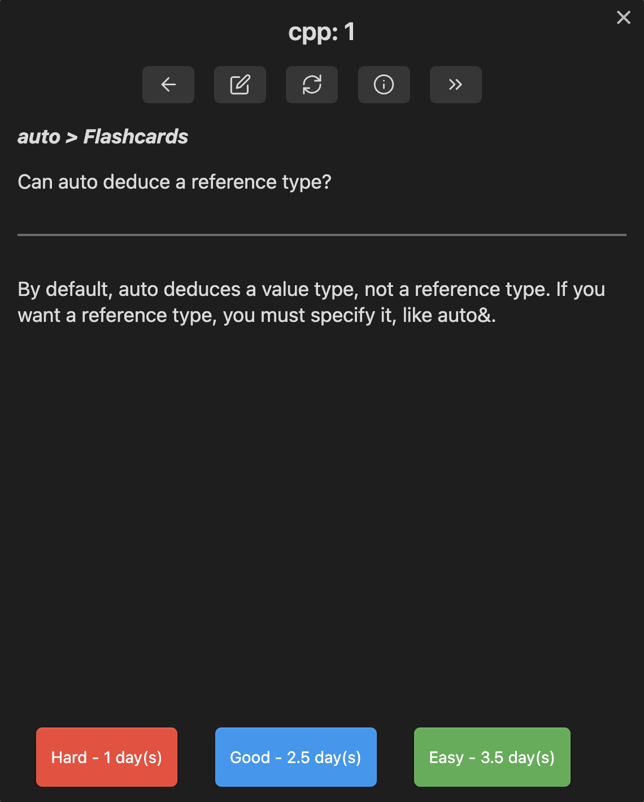

We've all experienced it: learning something fascinating, acing the exam, and then forgetting it all. Those valuable insights get buried, never to be seen again. Welcome to the world of Obsidian, a solution that turns fleeting notes into an enduring tapestry of interconnected ideas.

## What is Obsidian?

Obsidian is more than just an open-source, markdown-based note-taking app. It's a unique digital workspace designed to link thoughts and ideas, turning scattered notes into a coherent knowledge base that stands out from your typical note-taking solutions.

### What are its core features?

Let's dive into what makes Obsidian a powerful ally in your learning adventure:

1. **Markdown Based Note-taking**
Simple and elegant, Obsidian lets you write in markdown format. If you're new to markdown, here's a handy [guide](https://www.markdownguide.org/).
2. **Linking Notes**
The heart of Obsidian, linking notes allows you to create a web of interconnected ideas. It's bidirectional, meaning linking from Note A to Note B also shows a backlink from Note B to Note A.
3. **Plug-ins**  
Obsidian being an open source tool has a rich ecosystem that allows you to add extra features to the software. These can range from simple formatting tools to complex data visualization utilities.

## How do I use Obsidian?

Here's how I use Obsidian for long-term learning, focusing on three principles:

* **Markdown Hierarchy**: Organizing notes with headings and subheadings.
* **The Zettelkasten Technique**: A method of linking individual notes or ideas.
* **Spaced Repetition**: A study method for reinforcing retention.

### How can we use the Markdown Hierarchy?

First thing you notice when looking at my notes is that they're pretty easy on the eyes. One of the very simple, but I think really important benefits of Obsidian is that it hides text with lower priority headings under higher priority headings. This simple feature allows me to navigate my notes efficiently, zeroing in on relevant information specific to my query, without unnecessary distractions.

Another distinctive feature of my notes is that all the headers for different topics are framed as questions. Whether you're glancing at the headings within my notes or the titles of my blog posts, you'll quickly discern a pattern: I'm someone who is particularly fond to questions.

Whenever I consult my notes its almost always because I have a question in mind. I'm a question thinker, so it just clicks to shape my notes as a set of questions rather than composing them in a declarative manner. This way, I skip the extra task of figuring out if a chunk of my notes really answers the question I'm wrestling with.

So lets say I want to focus on optimizing my code for better cache utilization. Well just by clicking on my last heading I can get:

And from here I can continue to use headings to further navigate to more specific areas of notes that I think can help me anser my question.

### How can we use the Zettelkasten technique?

The Zettelkasten method, an index card knowledge management system, uses individual notes or "Zettels" to represent single ideas. These notes are linked in a non-hierarchical network, allowing complex relationships between ideas.

Obsidian integrates this method with its linking system. A link within a note is formatted as:

    [[Name of Note #(optional)text to link to |(optional)Link appearance]]

While the structure of links may initially appear complex, they are elegantly composed of three distinct components:

1. **Linked File's Name**: The specific file you want to link to.
2. **Optional Heading or Text Block Identifier**: Utilize # to link to a specific heading or ^ to link to a particular text block within the file.
3. **Optional Customization**: Use | to personalize how the link appears in the editor.

For instance, a link crafted like this:

                    [[Example#Test|This is an example link]]

Would look like this in the editor:

Upon clicking, it would seamlessly navigate to the heading `Test` within the note titled `Example`, as illustrated below:

When I dive into learning something new, my journey begins with a single note filled with everything I find vital. I never fret about clutter or chaos, for the magic happens in the next step: organizing these notes.

I return to my scattered thoughts and sift through the various topics I've explored. If a subject calls for special attention, I craft a separate file and link to it using Obsidian's link feature. This process is emblematic of the Zettelkasten technique.

It's more than mere note-taking; it's a dance of understanding, connecting, and weaving intricate relationships between concepts. It's not just about retaining information; it's about building a robust and lasting foundation for learning. This revision emphasizes the importance of reviewing and connecting notes, highlighting that the real learning occurs in the process of organizing and linking, rather than simply jotting down information.

### How can we use Spaced Repetition?

But of course there times when memorization is essential—those finals are no joke. That's when Spaced Repetition becomes more than a study tool; it's a lifeline. Spaced Repetition involves reviewing learned material at increasing intervals, making the information stick. It's not just a theory; it's backed by solid research.

Now, for Obsidian users, we can thank its rich plugin ecosystem to give us something special: a well-crafted Spaced Repetition plugin that integrates seamlessly with Obsidian. You can explore this fantastic tool [here](https://github.com/st3v3nmw/obsidian-spaced-repetition).

This Spaced Repitition Plugin allows you to easily create your flashcards from within the Obsidian editor. You'll be prompted with a question from your flashcard set, and you have the option to reveal the answer. Once revealed, you can rate the difficulty of the question, and this rating helps determine when you'll be prompted with that question again.

You can actually augment the algorithim that it uses to determine when to asses you to further suit it to your learning experience.

I'm a firm believer in choosing plugins that fit your unique needs, but this one feels different. If you're using Obsidian for note-taking or long-term learning, I find this plugin to be more than just handy; I see it as essential.

## Last Thoughts?

Obsidian offers a unique approach to note-taking, turning scattered thoughts into a connected knowledge base. Whether you're a student, researcher, or lifelong learner, give Obsidian a try and discover a new way to learn and remember. Start your journey [here](https://obsidian.md/plugins).
